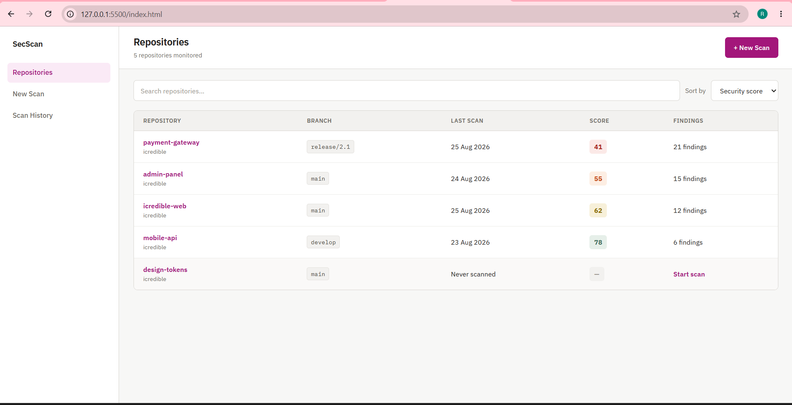
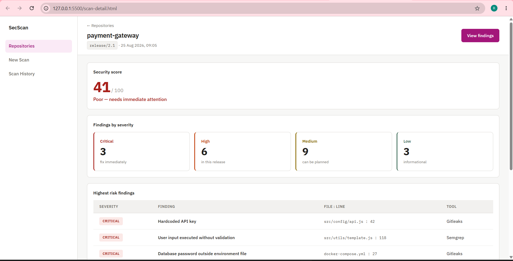
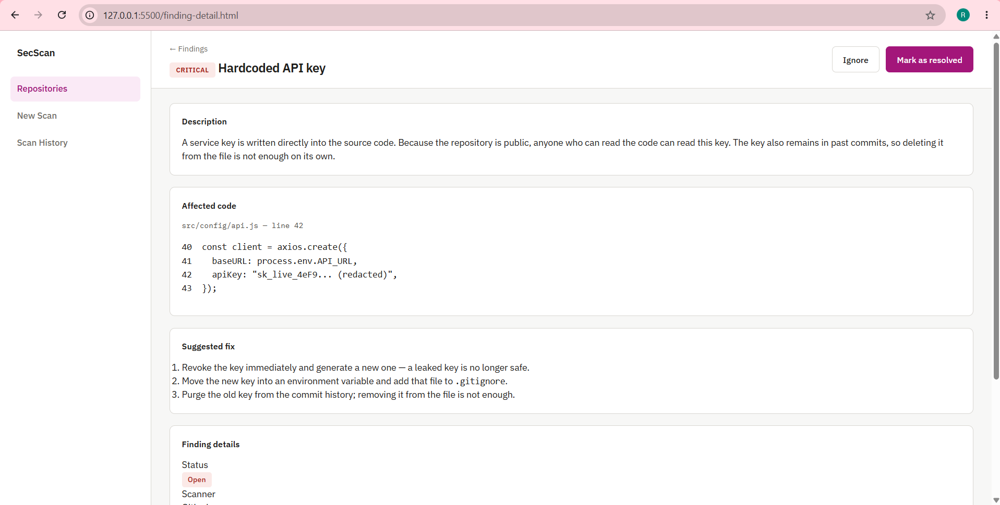
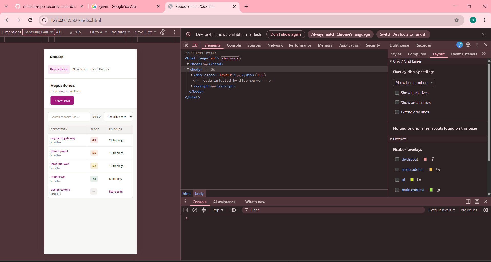

# SecScan — Repository Security Scan Dashboard

A web interface that presents security scan results for GitHub repositories in a clear, filterable way. Built as the final project of my internship at iCredible Technologies.

> Scans are simulated. Results come from prepared sample data; the goal is to model security data correctly and present it clearly, not to build a scanner.

## Screens

| Page | Purpose | States |
|---|---|---|
| Repositories | Monitored repositories with branch, last scan, score and finding count. Search and sort. | loading / empty / error |
| New Scan | Repository URL, branch, tool selection, start a simulated scan | idle / scanning / completed |
| Scan Detail | Security score, severity breakdown, highest-risk findings, scan info | completed / not scanned / not found |
| Findings | All findings of a scan with severity filter, search and sorting | results / no results |
| Finding Detail | Description, affected file and line, impact and suggested fix | open / resolved / ignored |
| Scan History | Score trend chart and list of previous scans | first scan / history |

## Screenshots









## Project structure

The project was built in three steps, and each step is kept in the repository:

| Folder / files | Version |
|---|---|
| `*.html`, `styles.css` | Static HTML + CSS pages |
| `js/`, `data/mock-data.js` | Same pages driven by vanilla JavaScript |
| `react-app/` | Final React version |

```
react-app/src/
  components/   reusable UI pieces (SeverityBadge, SecurityScore, FindingTable, ...)
  pages/        one component per screen (Repositories, ScanDetail, Findings, ...)
  data/         mock data and a fake API with a short delay
  hooks/        useFetch — loading, error and data state
  utils/        calculateScore, filterFindings, date/time helpers
  App.jsx       routes
```
## Running locally

Requirements: Node.js 18 or newer.

```
git clone https://github.com/refiazra/repo-security-scan-dashboard.git
cd repo-security-scan-dashboard/react-app
npm install
npm run dev
```

Then open `http://localhost:5173`.

To see the error state, add `?error=1` to any page URL (for example `http://localhost:5173/?error=1`).

The earlier HTML/JavaScript version can be opened with VS Code Live Server from the project root (`index.html`).

## Tech stack

- HTML5 (semantic markup)
- CSS3 (Flexbox, Grid, custom properties, media queries)
- JavaScript (DOM, events, array methods, query parameters)
- React 18, React Router, Vite

## Security notes

- No real passwords, tokens or customer data are used. Secrets in the sample findings are redacted.
- All data is shown as plain text, so no one can inject code into the page (XSS protection).
- Values from the URL are only used to find data, never shown on the page directly.
- Form validation in the browser is only for user convenience. A real backend must validate every request again, because frontend checks can be bypassed.
- Every finding includes a suggested fix.

## Accessibility notes

- Every form field has a label
- Keyboard focus is always visible
- Severity is shown with text, not color alone
- Screen readers can tell which filter is selected and read scan status and errors aloud
- No horizontal scrolling on mobile

## Author

Refia Azra Dikyar — iCredible Technologies internship, 2026
